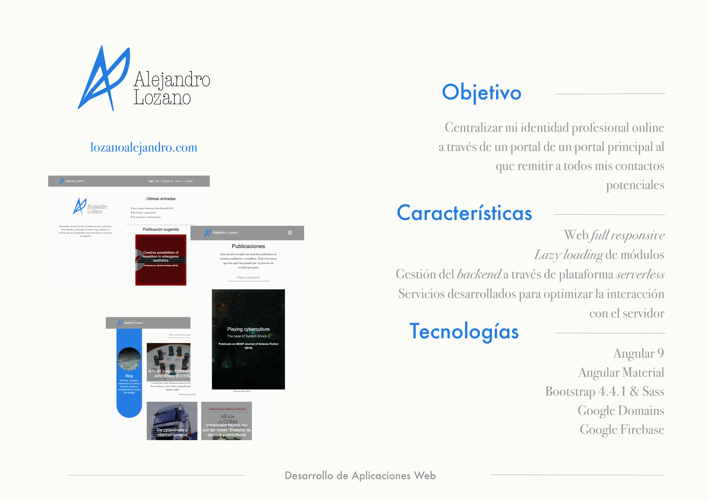

# Web de Alejandro Lozano

Esta web concentra los aspectos fundamentales de mi actividad como investigador y docente universitario. En ella publico reflexiones, noticias y eventos relacionados con la filosofía y la tecnología y doy a conocer los artículos que he publicado en revistas académicas con sistema de revisión por pares (*peer reviewed*).

## Especificaciones

- **Desarrollo con Angular:** se ha aprovechado este proyecto para profundizar en el funcionamiento y las herramientas de Angular, incorporando, entre otros, *lazy loading* de rutas y módulos y la división de la app en *feature modules*.

- **Estructura de estilos con Sass**: para organizar el código de los estilos hemos seguido el patrón 7-1 y la metodología BEM a la hora de nombrar las clases.

- **Gestión del *backend* a través de Google Firebase**: la información de la web se aloja en Cloud Firestore, y los medios en Cloud Firestorage. 

